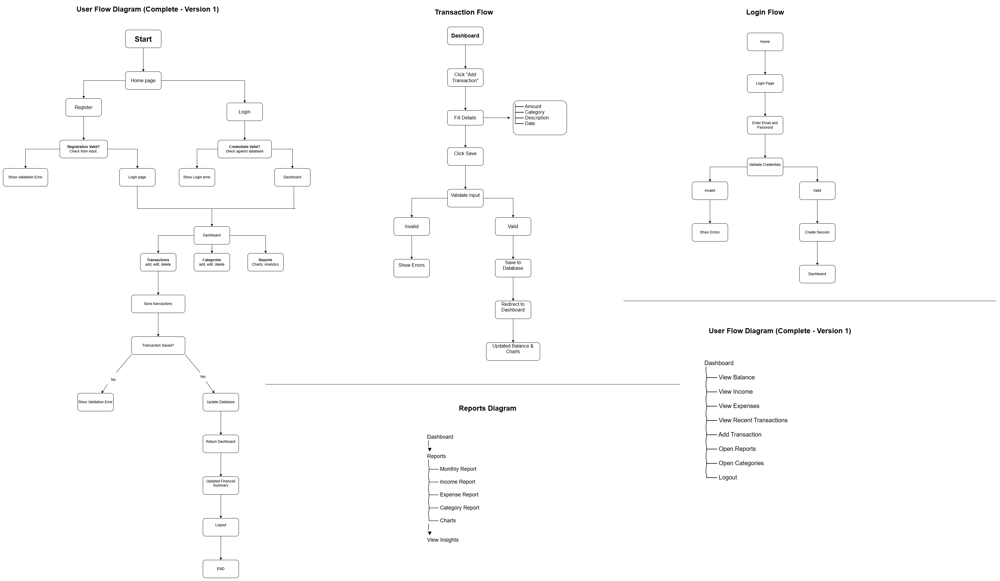
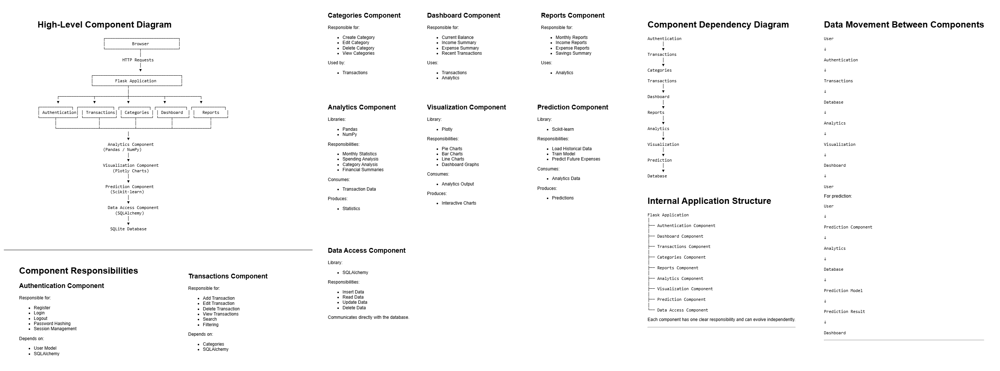
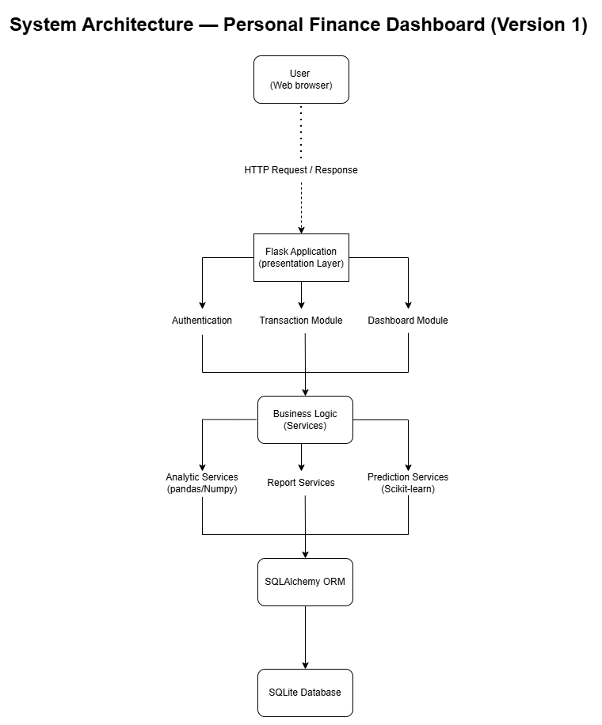

# Personal Finance Dashboard (Frontend)

A modern, responsive frontend for a personal finance management application. Built with Next.js and TypeScript, it lets users track income and expenses, manage categories, view interactive charts and reports, and get ML-powered expense predictions, all through a clean, design-first interface.

This repository contains the **frontend** only. It consumes a Flask REST API over HTTP/JSON.

> **Built design-first.** Before writing any code, the entire system was planned across 11 design diagrams (vision, use cases, user flows, component diagrams, and more). The folder structure, features, and pages were derived directly from these diagrams.

**Backend repository:** [my-finance](https://github.com/Kazim0071/my-finance.git)

## Key Features

- **Authentication**: register, login, and logout with session-based auth. Protected routes redirect unauthenticated users to login.
- **Dashboard**: real-time summary of total income, total expense, balance, recent transactions, and ML-powered next month expense prediction.
- **Transaction Management**: add, edit, and delete transactions with type (income/expense), category, amount, date, and description. Filter by type.
- **Category Management**: add, edit, and delete categories with a name, emoji icon, and color.
- **Reports**: interactive bar chart (monthly income vs expense) and pie chart (expense breakdown by category), powered by Recharts.
- **CSV Export**: download all transactions as a CSV file directly from the reports page.
- **Profile Management**: update name and email, and change password — all from a single profile page.
- **ML Expense Prediction**: displays next month's predicted expense with a confidence level (low / medium / high) on the dashboard.

## Tech Stack

| Purpose | Technology |
|---|---|
| Framework | Next.js 14 (App Router) |
| Language | TypeScript |
| Styling | Tailwind CSS |
| Forms | React Hook Form |
| Validation | Zod |
| Charts | Recharts |
| HTTP client | Fetch API (custom `api-client` wrapper) |
| Auth state | React Context API |

## Design-First Methodology

This project was fully modelled **before** implementation. Each part of the UI was derived from a specific design diagram. In total, 11 diagrams were created during the planning phase.

| # | Diagram | What it produced in the codebase |
|---|---|---|
| 1 | Vision Diagram | Overall product goal and scope |
| 2 | Feature Map | Feature breakdown and build priority |
| 3 | User Journey | End-to-end user experience |
| 4 | User Flow | Screen-to-screen navigation logic |
| 5 | Use Case Diagram | The list of pages and components to build |
| 6 | Domain Model | Business entities (cross-check for types) |
| 7 | ERD | Data shapes used in TypeScript interfaces |
| 8 | System Architecture


## Design-First Methodology

This project was fully modelled **before** implementation. Each part of the UI was derived from a specific design diagram. In total, 11 diagrams were created during the planning phase.

| # | Diagram | What it produced in the codebase |
|---|---|---|
| 1 | Vision Diagram | Overall product goal and scope |
| 2 | Feature Map | Feature breakdown and build priority |
| 3 | User Journey | End-to-end user experience |
| 4 | User Flow | Screen-to-screen navigation logic |
| 5 | Use Case Diagram | The list of pages and components to build |
| 6 | Domain Model | Business entities (cross-check for types) |
| 7 | ERD | Data shapes used in TypeScript interfaces |
| 8 | System Architecture | The decoupled API + Next.js decision |
| 9 | Sequence Diagrams | Step-by-step logic inside each feature |
| 10 | Activity Diagrams | Branching / decision logic within flows |
| 11 | Component Diagram | The application's folder structure |

### User Flow Diagram

The user flow defined exactly which pages and navigation paths the frontend needed.

[](docs/images/user-flow.png)

### Component Diagram

The component diagram translated directly into the project's folder structure, one feature per folder.

[](docs/images/component.png)

## System Architecture

The frontend is a **decoupled client** — it has no database and no server-side business logic. All data comes from the Flask backend over HTTP/JSON. Next.js App Router handles routing and rendering.

[](docs/images/architecture.png)

**Why decoupled?**

- **Separation of concerns**: the backend handles data and business logic; the frontend handles all UI. Each can be developed and deployed independently.
- **Right deployment for each part**: the Next.js frontend deploys to Vercel; the Flask API runs on its own server.
- **Future flexibility**: any other client (mobile app, third-party integration) can consume the same API without changes.

Since the frontend and backend run on different origins, all API calls use `credentials: "include"` so session cookies are sent with every request.

## Project Structure

```
my-finance-frontend/
│
├── app/                         # Next.js App Router — pages and layouts
│   ├── layout.tsx               # Root layout
│   ├── page.tsx                 # Home / landing page
│   ├── login/
│   │   └── page.tsx
│   ├── register/
│   │   └── page.tsx
│   └── dashboard/
│       ├── layout.tsx           # Dashboard layout — auth guard, navbar, footer
│       ├── page.tsx             # Dashboard home
│       ├── transactions/
│       │   └── page.tsx
│       ├── categories/
│       │   └── page.tsx
│       ├── reports/
│       │   └── page.tsx
│       └── profile/
│           └── page.tsx
│
├── features/                    # Feature modules — each owns its types, api, schema, components
│   ├── auth/
│   │   ├── types.ts
│   │   ├── api.ts
│   │   ├── schema.ts
│   │   ├── AuthContext.tsx
│   │   └── components/
│   │       ├── LoginForm.tsx
│   │       ├── RegisterForm.tsx
│   │       ├── EditProfileForm.tsx
│   │       └── ChangePasswordForm.tsx
│   ├── categories/
│   │   ├── types.ts
│   │   ├── api.ts
│   │   ├── schema.ts
│   │   └── components/
│   │       ├── CategoryList.tsx
│   │       ├── CategoryCard.tsx
│   │       └── CategoryForm.tsx
│   ├── transactions/
│   │   ├── types.ts
│   │   ├── api.ts
│   │   ├── schema.ts
│   │   └── components/
│   │       ├── TransactionList.tsx
│   │       ├── TransactionCard.tsx
│   │       └── TransactionForm.tsx
│   ├── reports/
│   │   ├── types.ts
│   │   ├── api.ts
│   │   └── components/
│   │       ├── MonthlyChart.tsx
│   │       └── CategoryChart.tsx
│   ├── dashboard/
│   │   ├── types.ts
│   │   └── api.ts
│   └── ml/
│       ├── types.ts
│       ├── api.ts
│       └── components/
│           └── PredictionCard.tsx
│
├── components/                  # Shared, reusable components
│   └── layout/
│       ├── navbar.tsx
│       └── footer.tsx
│
├── lib/                         # Utilities and HTTP client
│   ├── api-client.ts            # Fetch wrapper with credentials: include
│   └── utils.ts
│
├── .env.local                   # Environment variables (git-ignored)
├── .env.example                 # Template for required environment variables
├── next.config.ts
├── tailwind.config.ts
├── tsconfig.json
└── package.json
```

## Key Engineering Decisions

**1. Feature-based folder structure, not layer-based.**
Each feature (`auth`, `categories`, `transactions`, `reports`, `ml`) owns its `types.ts`, `api.ts`, `schema.ts`, and `components/` — everything related to that feature lives together. This makes it easy to find, change, and reason about any feature in isolation, compared to grouping all types together, all components together, and so on.

**2. Single `api-client.ts` wrapper for all HTTP calls.**
All fetch calls go through a single `apiClient` function that sets `Content-Type`, `credentials: "include"`, and handles error parsing centrally. Individual feature `api.ts` files call this wrapper — they never call `fetch` directly. This means auth headers, error handling, and base URL are configured in one place.

**3. Zod + React Hook Form for all forms.**
Every form uses a Zod schema as the single source of truth for validation rules. React Hook Form's `zodResolver` connects the schema to the form, so client-side validation and TypeScript types are both derived from the same definition. This eliminates duplication between runtime validation and type annotations.

**4. TypeScript interfaces derived from backend `to_dict()` responses.**
Every `types.ts` file reflects exactly what the Flask backend returns — the shapes were derived from the backend's `to_dict()` methods rather than invented independently. This keeps the contract between frontend and backend explicit and easy to verify.

**5. Auth state in React Context, not a global store.**
User state is managed with a simple `AuthContext` and `useAuth` hook. The dashboard layout's auth guard checks this context and redirects unauthenticated users to login. No third-party state management library was needed given the scope of the application.

**6. `credentials: "include"` on every request.**
Session authentication relies on cookies. Every API call includes `credentials: "include"` so the browser sends the session cookie with cross-origin requests to the Flask backend.

**7. Recharts for data visualization.**
Recharts was chosen for its React-first API and clean integration with Next.js. The monthly report uses a `BarChart` and the category breakdown uses a `PieChart`. Category colors set by the user in the app are passed directly to chart cells, keeping the visual consistent with the rest of the UI.

## Getting Started

### Prerequisites

- Node.js 18+
- npm
- The backend API running at `http://localhost:5000`

### Installation

```bash
# 1. Clone the repository
git clone https://github.com/Kazim0071/my-finance-frontend.git
cd my-finance-frontend

# 2. Install dependencies
npm install

# 3. Set up environment variables
cp .env.example .env.local
```

Add the following to your `.env.local`:

```env
NEXT_PUBLIC_API_URL=http://localhost:5000
```

```bash
# 4. Run the development server
npm run dev
```

The app will be running at `http://localhost:3000`.

> Make sure the backend is running at `http://localhost:5000` before starting the frontend.

The app will be running at `http://localhost:3000`.

> Make sure the backend is running at `http://localhost:5000` before starting the frontend.

## Roadmap

### Completed in Version 2
- **Frontend (Next.js)** — fully implemented client application with dashboard, transactions, categories, reports, profile management, and ML prediction card. Interactive charts built with Recharts.

### Version 3
- **Budget limits per category** — set monthly spending limits and see progress visually.
- **Recurring transactions** — automatically log fixed monthly income or expenses.

## Author

**Qasim Amir**
[LinkedIn](https://www.linkedin.com/in/qasimstack/) · [GitHub](https://github.com/Kazim0071)

Built as a design-first, Agile/Scrum project, planned across 11 design diagrams before implementation.
